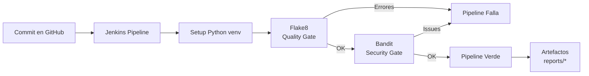
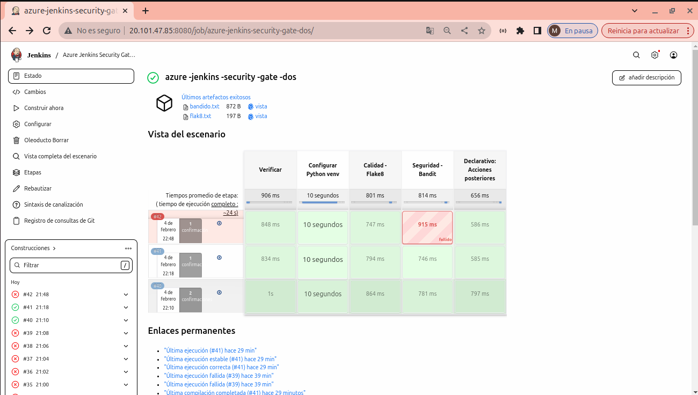
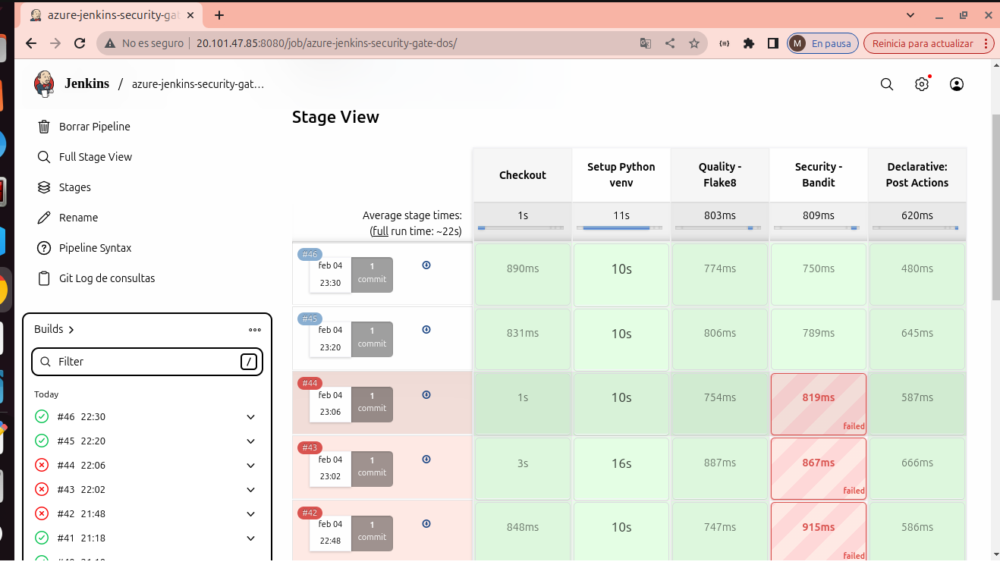
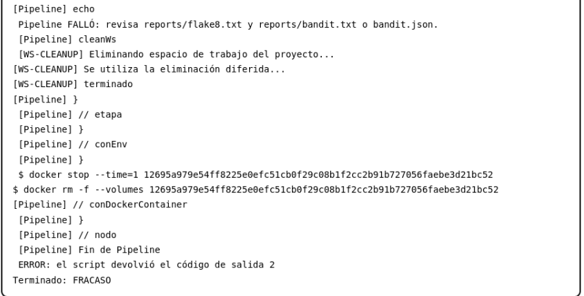

# Azure Jenkins Security Gate (Flake8 + Bandit)

Pipeline mínimo viable en Jenkins que aplica **quality y security gates** sobre un proyecto Python, bloqueando código inseguro antes de llegar a producción.

Job en Jenkins: **azure-jenkins-security-gate-dos**

---

## 🎯 Qué problema resuelve

En muchos equipos el código llega a `main` porque “funciona”, pero:
- Tiene problemas de calidad (estilo, malas prácticas)
- Contiene vulnerabilidades comunes (por ejemplo `eval()`)

Este proyecto demuestra cómo **detectar y bloquear automáticamente** esos riesgos usando Jenkins.

## 🔁 Flujo del pipeline


---

## ⚙️ Qué hace el pipeline

El pipeline se ejecuta en un contenedor Docker con Python 3.10 y contiene los siguientes stages:

1. **Checkout**  
   Descarga el repositorio desde GitHub.

2. **Setup Python venv**  
   - Comprueba versión de Python  
   - Crea un entorno virtual (`.venv`)  
   - Instala dependencias desde `requirements.txt`

3. **Quality – Flake8**  
   Analiza el código en `src/` y falla si hay errores de estilo o calidad.  
   Genera el artefacto:
   - `reports/flake8.txt`

4. **Security – Bandit**  
   Analiza el código en busca de vulnerabilidades de seguridad.  
   Si encuentra issues, **el pipeline falla** (security gate).  
   Genera el artefacto:
   - `reports/bandit.json`

5. **Post actions**  
   Archiva los reportes para poder revisarlos desde Jenkins.

---

# 📁 Estructura del proyecto

```md
.
├── Jenkinsfile
├── requirements.txt
├── src/
│   └── app.py
├── reports/              # Generados por el pipeline
├── infra/
│   └── terraform/        # (opcional) Infraestructura en Azure
└── docs/
    └── img/              # Imágenes usadas en este README
```
---

## 🔥 Caso real: `eval()` → fallo → corrección

### ❌ Versión vulnerable (pipeline falla)

En `src/app.py` se utilizaba: `eval()`, lo que permite la ejecución de código arbitrario:

```python
return eval(user_input)
```
Bandit detecta esta vulnerabilidad como B307 (use of eval) y bloquea automáticamente el pipeline.

📸 Evidencias



---

✅ Versión corregida

Se reemplaza `eval()` por `ast.literal_eval()`, que solo permite literales seguros:

```python
import ast

return ast.literal_eval(user_input)
```
Bandit ya no detecta vulnerabilidades y el pipeline Finaliza en verde.

📸 Evidencias



---

📦 Artefactos generados

El pipeline archiva automáticamente los reportes para su revisión:
```
 reports/flake8.txt
```
```
 reports/bandit.json
```

📸 Evidencia:



---

> Nota: este proyecto utiliza Python como ejemplo práctico.
> El mismo patrón de pipeline puede adaptarse a otros lenguajes
> sustituyendo las herramientas de análisis (por ejemplo:
> ESLint, SonarQube, Trivy, etc.).

---

## ▶️ Cómo reproducir el escenario

Este proyecto está pensado para ejecutarse **dentro del pipeline de Jenkins**.

Para reproducir el comportamiento:
1. Introducir código vulnerable (por ejemplo `eval()`) en `src/app.py`
2. Hacer commit en la rama `main`
3. Jenkins ejecuta el pipeline y falla en el stage **Security - Bandit**
4. Corregir el código y volver a hacer commit
5. El pipeline finaliza correctamente

---

✅ Conclusión

Este proyecto demuestra cómo implementar un security gate real en Jenkins:

- Se bloquea código inseguro automáticamente

- Se garantiza un mínimo de calidad con Flake8

- Los resultados quedan registrados como artefactos

- El pipeline es reproducible y extensible

---

💡 Próximos pasos (opcional)

- Añadir más reglas de seguridad

- Integrar análisis de dependencias

- Reutilizar el patrón en otros proyectos